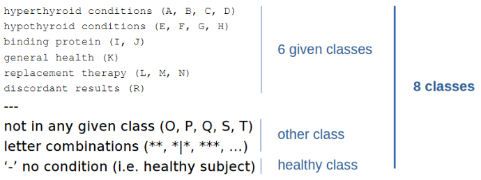
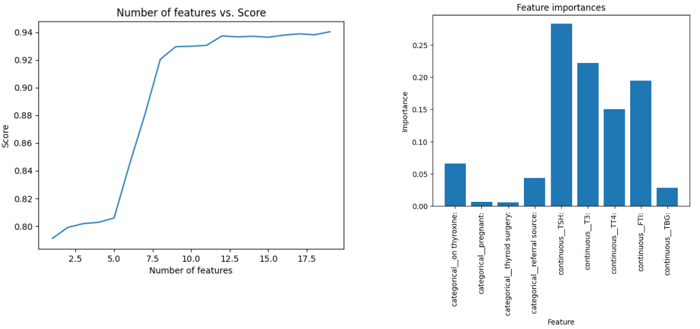
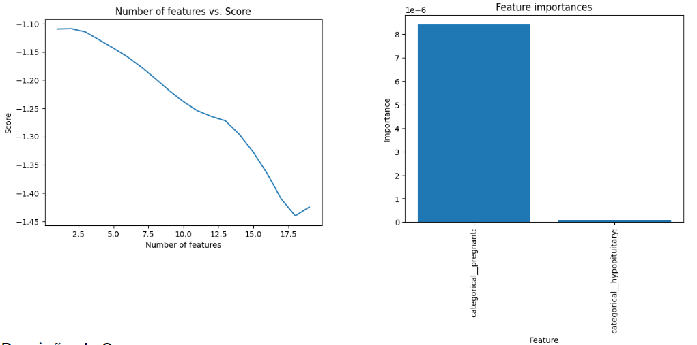
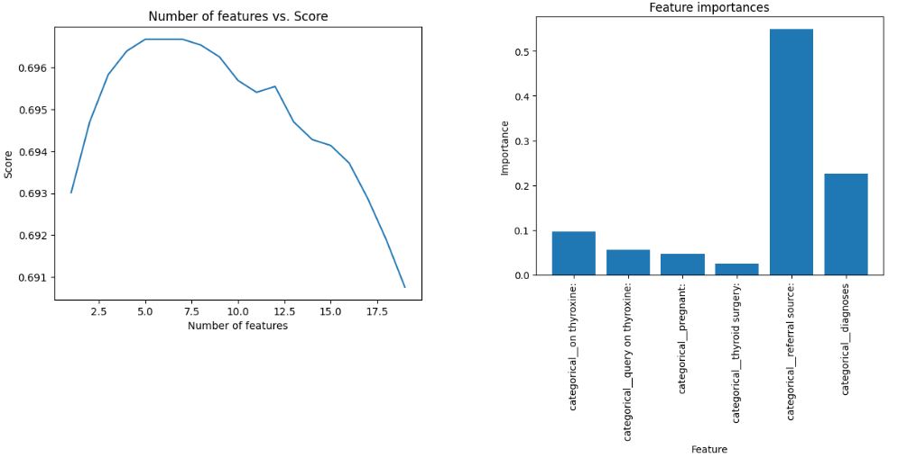
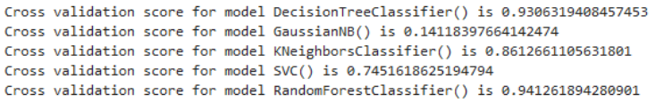
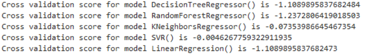
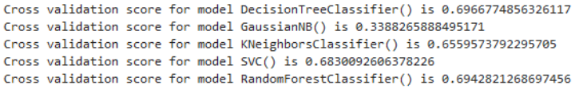
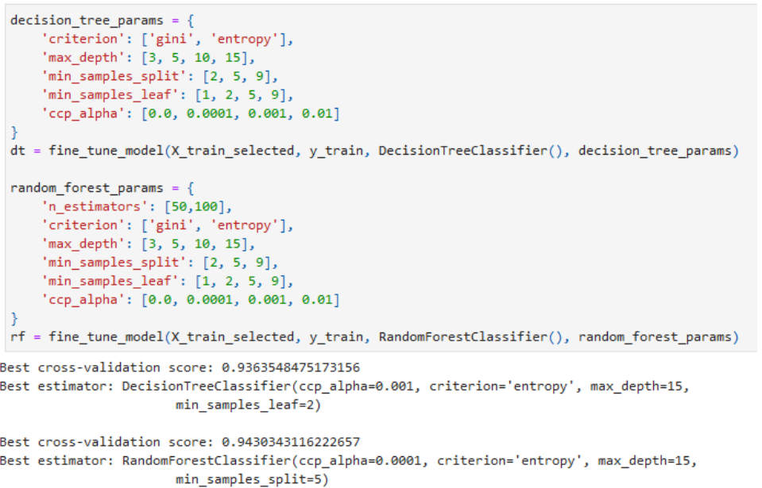
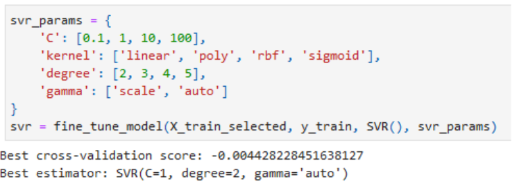
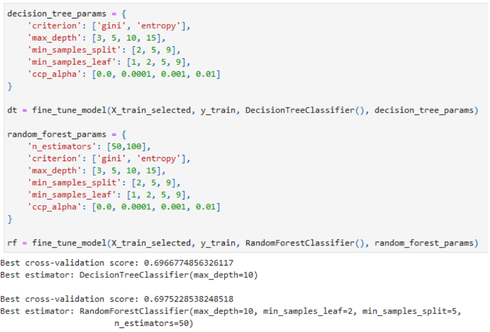

# Prediction of Thyroid Diagnoses - Knowledge Engineering

**Authors:**
- Guilherme Sousa (fc58170)
- Gabriel Henriques (fc58182)

**Grade:** 17/20

## Introduction and Objectives
This report presents the results of an analysis of a thyroid-related dataset, specifically a version of the "thyroid0387" dataset. The complete data profile and characteristics can be found [here](docs/data_profile.html).

The main objective of this work was to develop the best possible classification model to predict patient diagnoses based on the characteristics available in the dataset, categorizing them into eight distinct diagnostic classes. Additionally, using the same data, we had to develop models to predict patients' age and sex.

From the obtained models, we also analyzed which characteristics most influenced their predictions.

Throughout this report, we will describe the steps and methods we used to process the data, select variables, select models, and adjust model parameters.

## Data Processing
In the processing step, we initially performed data cleaning where we separated the dataset columns into two types: categorical characteristics and continuous characteristics. We replaced all missing data (with '?') with NaNs, removed the "[record identification]" column, and translated the "diagnoses" column as follows:

For sex prediction, we also removed the rows from the dataset that had missing "sex" characteristics. Subsequently, we ran a pipeline with separate preprocessing methods for categorical and continuous variables.

For categorical variables, a SimpleImputer with "constant" strategy is executed, replacing all NaNs with "missing", and an OrdinalEncoder which, due to scikit-learn's limitation, is necessary to convert categorical variables to numerical ones. We chose this encoder because, although we don't necessarily believe there is an order in categorical variables, we encountered difficulties using two other encoders that we thought would be more appropriate (OneHotEncoder and LabelEncoder).

For continuous variables, a SimpleImputer with "constant" strategy is also executed, replacing NaNs with "-1" to differentiate unmeasured data (since negative values are not natural in health data) and also a MinMaxScaler because there are variables of quite different magnitudes, so scaling was necessary to prevent this magnitude difference from influencing their weight.

We decided not to replace missing data with other values, such as using the mean or most frequent value, because with measured health data, these substitute values might not reflect the patient's true health condition. Additionally, the absence of data can itself be informative and indicate certain health conditions or data collection patterns.

## Variable Selection
For variable selection, we used SequentialFeatureSelector with default selection mode (forward selection). For diagnosis and sex prediction, we used DecisionTreeClassifier as models, and for age prediction, we used LinearRegression, as these are the models we are most familiar with. In cases where the score remained similar, we chose to select the smallest number of attributes to avoid the risk of overfitting to the training data.

### Diagnosis Prediction:

### Age Prediction:

### Sex Prediction:

## Model's Results
We tested various models that we were familiar with from practical classes, using cross-validation to see which best fit the data, and obtained the following results:

### Diagnosis Prediction:

### Age Prediction:

### Sex Prediction:

## Hyperparameter Tuning
From the previously tested models, we selected those that obtained the best results to adjust their parameters to achieve even better results! For this, we used GridSearchCV with default 5-fold cross-validation due to its robustness, scalability with large datasets, and ease of use. For each prediction, we adjusted the parameters and obtained the following results:

### Diagnosis Prediction:

### Age Prediction:

### Sex Prediction:

## Discussion and Conclusions
From this analysis, we found that for diagnosis prediction, the best model would be RandomForestClassifier with parameters [ccp_alpha=0.0001, criterion='entropy', max_depth=15, min_samples_split=5]. This achieved very good results in cross-validation (0.943), and with the excerpt of data provided for testing, it achieved an accuracy of 0.85. We were therefore satisfied and confident that it would mostly evaluate well any additional test data submitted to it.

Regarding age and sex prediction, we assumed we could use patients' diagnoses as an attribute, which proved relevant in determining sex, being the second most important characteristic.

For sex prediction, the results were not as impressive as those for diagnosis, having obtained a cross-validation score of 0.697. We ended up choosing the RandomForestClassifier model with parameters [max_depth=10, min_samples_leaf=2, min_samples_split=5, n_estimators=50], although the DecisionTreeClassifier obtained very similar results. We concluded that we can predict a patient's sex with approximately 70% certainty.

Finally, the models for predicting age obtained disastrous results. We couldn't understand if this was due to an error in our analysis and interpretation or due to data quality. Nevertheless, we still managed to choose and adjust a model that had less poor results: SVR with parameters [C=1, degree=2, gamma='auto']. We concluded that it is not possible to predict a patient's age given the other attributes. 